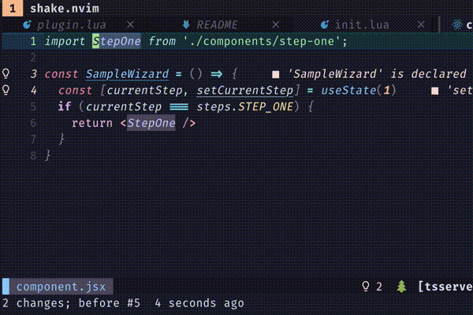
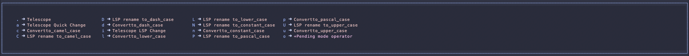

# text-case.nvim

An all in one plugin for converting text case in Neovim. It converts a piece of text to an indicated string case and also is capable of bulk replacing texts without changing cases

## Features

### Quick conversion

Converts text under cursor to another case. Only 3 keys to convert the current text. 
<sub>Repeatable using `.`</sub>

Smartly guesses the current object using the following strategies:

* Tree Sitter (if available) [WIP]
* Word under cursor
* Ignore word separators


### LSP conversion

Converts definition under cursor to another case. Use Language Server Protocol to modify the definition, references and usages of the word under cursor
<sub>Repeatable using `.`</sub>

### Targeted conversion

Converts given objects, it might require more key presses than the quick conversion but allows to control the specific target. 
<sub>Repeatable using `.`</sub>

Supported targets:

* Vim objects: w, iw, aw, e, p, ...
* Selected text in visual mode

### Bulk smart replacement

Converts all forms of a specific text, the replaced text will keep the original text case.

If not specified, it replaces every instance of the text in the current file; But it could be also scoped to the selected block:



### String case conversions

It is also a library of text case conversion methods. Useful for your LUA code.

|      Case     | Example     | Method                     |
|---------------|-------------|----------------------------|
| Upper case    | LOREM IPSUM | textcase.api.to_constant_case |
| Lower case    | lorem ipsum | textcase.api.to_lower_case    |
| Snake case    | lorem_ipsum | textcase.api.to_snake_case    |
| Dash case     | lorem-ipsum | textcase.api.to_dash_case     |
| Constant case | LOREM_IPSUM | textcase.api.to_constant_case |
| Dot case      | lorem.ipsum | textcase.api.to_dot_case      |
| Camel case    | loremIpsum  | textcase.api.to_camel_case    |
| Pascal case   | LoremIpsum  | textcase.api.to_pascal_case   |
| Title case    | Lorem Ipsum | textcase.api.to_title_case    |
| Path case     | lorem/ipsum | textcase.api.to_path_case     |
| Phrase case   | Lorem ipsum | textcase.api.to_phrase_case   |

## Setup

Install with your favorite plugin manager. The setup function, sets up the default keybinding. To setup custom key maps, do not call `require('textcase').setup{}`, and follow the example bellow

Example in LUA using Packer.nvim. Default keybinding

```lua
use { "johmsalas/text-case.nvim",
  config = function()
    require('textcase').setup {}
  end
}
```

Example in VimScript using Plug. Custom keybinding

```vimscript
call plug#begin('~/.local/share/nvim/plugged')
Plug 'johmsalas/text-case.nvim'
call plug#end()

-- Example of custom keymapping
nnoremap gau :lua require('textcase').current_word('to_upper_case')<CR>
nnoremap gal :lua require('textcase').current_word('to_lower_case')<CR>
nnoremap gas :lua require('textcase').current_word('to_snake_case')<CR>
nnoremap gad :lua require('textcase').current_word('to_dash_case')<CR>
nnoremap gan :lua require('textcase').current_word('to_constant_case')<CR>
nnoremap gad :lua require('textcase').current_word('to_dot_case')<CR>
nnoremap gaa :lua require('textcase').current_word('to_phrase_case')<CR>
nnoremap gac :lua require('textcase').current_word('to_camel_case')<CR>
nnoremap gap :lua require('textcase').current_word('to_pascal_case')<CR>
nnoremap gat :lua require('textcase').current_word('to_title_case')<CR>
nnoremap gaf :lua require('textcase').current_word('to_path_case')<CR>

nnoremap gaU :lua require('textcase').lsp_rename('to_upper_case')<CR>
nnoremap gaL :lua require('textcase').lsp_rename('to_lower_case')<CR>
nnoremap gaS :lua require('textcase').lsp_rename('to_snake_case')<CR>
nnoremap gaD :lua require('textcase').lsp_rename('to_dash_case')<CR>
nnoremap gaN :lua require('textcase').lsp_rename('to_constant_case')<CR>
nnoremap gaD :lua require('textcase').lsp_rename('to_dot_case')<CR>
nnoremap gaA :lua require('textcase').lsp_rename('to_phrase_case')<CR>
nnoremap gaC :lua require('textcase').lsp_rename('to_camel_case')<CR>
nnoremap gaP :lua require('textcase').lsp_rename('to_pascal_case')<CR>
nnoremap gaT :lua require('textcase').lsp_rename('to_title_case')<CR>
nnoremap gaF :lua require('textcase').lsp_rename('to_path_case')<CR>

nnoremap geu :lua require('textcase').operator('to_upper_case')<CR>
nnoremap gel :lua require('textcase').operator('to_lower_case')<CR>
nnoremap ges :lua require('textcase').operator('to_snake_case')<CR>
nnoremap ged :lua require('textcase').operator('to_dash_case')<CR>
nnoremap gen :lua require('textcase').operator('to_constant_case')<CR>
nnoremap ged :lua require('textcase').operator('to_dot_case')<CR>
nnoremap gea :lua require('textcase').operator('to_phrase_case')<CR>
nnoremap gec :lua require('textcase').operator('to_camel_case')<CR>
nnoremap gep :lua require('textcase').operator('to_pascal_case')<CR>
nnoremap get :lua require('textcase').operator('to_title_case')<CR>
nnoremap gef :lua require('textcase').operator('to_path_case')<CR>
```

## How to use it

[Visit the wiki](https://github.com/johmsalas/text-case.nvim/wiki)

## Integrations

### Telescope integration

To list conversion options using Telescope, register the extension in telescope and setup keybindings for normal and visual mode

```lua
config = function()
  require('textcase').setup {}
  require('telescope').load_extension('textcase')
  vim.api.nvim_set_keymap('n', 'ga.', '<cmd>TextCaseOpenTelescope<CR>', { desc = "Telescope" })
  vim.api.nvim_set_keymap('v', 'ga.', "<cmd>TextCaseOpenTelescope<CR>", { desc = "Telescope" })
end
```

In the example above, when using in normal mode, it shows options for quick and LSP conversion of the string. It is also possible to trigger a list of options only for Quick Conversion, or only for LSP conversion
It only works for normal mode, because LSP does not make sense for visual mode

```
vim.api.nvim_set_keymap('n', 'gaa', "<cmd>TextCaseOpenTelescopeQuickChange<CR>", { desc = "Telescope Quick Change" })
vim.api.nvim_set_keymap('n', 'gai', "<cmd>TextCaseOpenTelescopeLSPChange<CR>", { desc = "Telescope LSP Change" })
```

### Which key integration

If which-key is preset, text-case.nvim registers descriptions for the conversion groups


